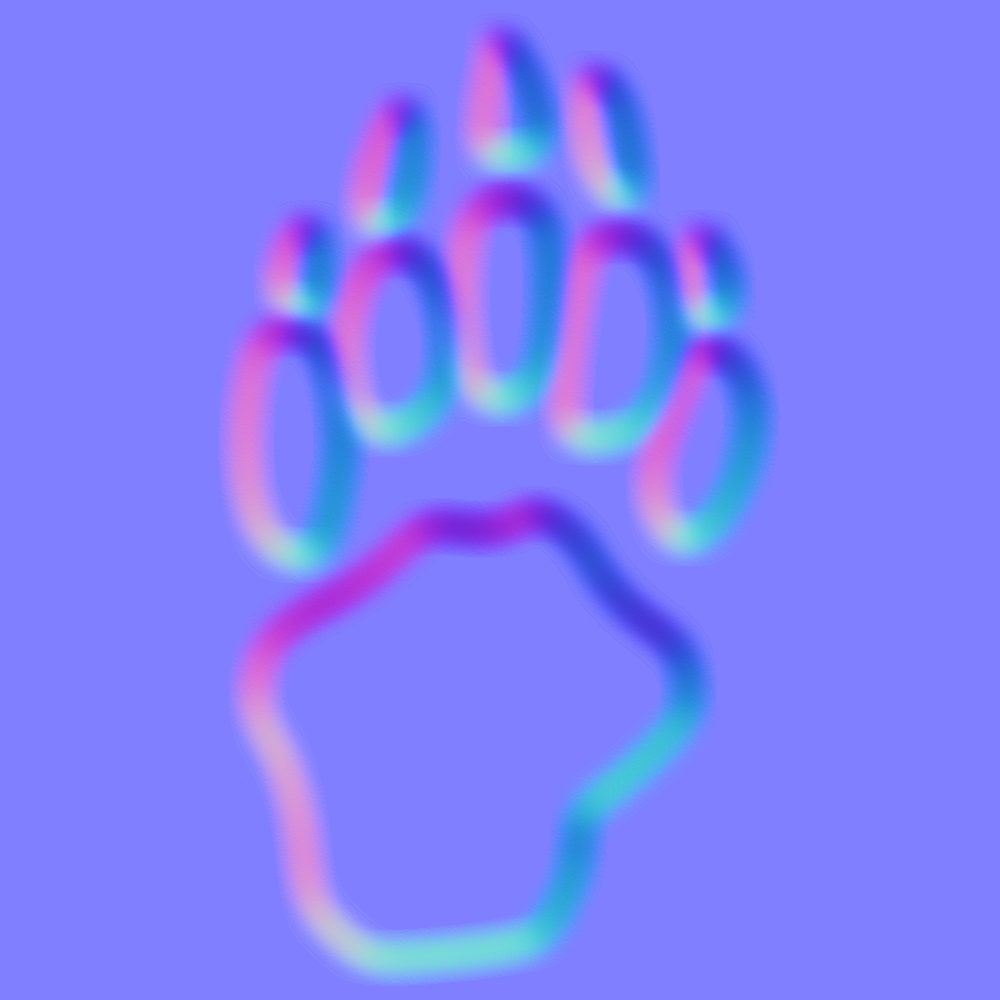
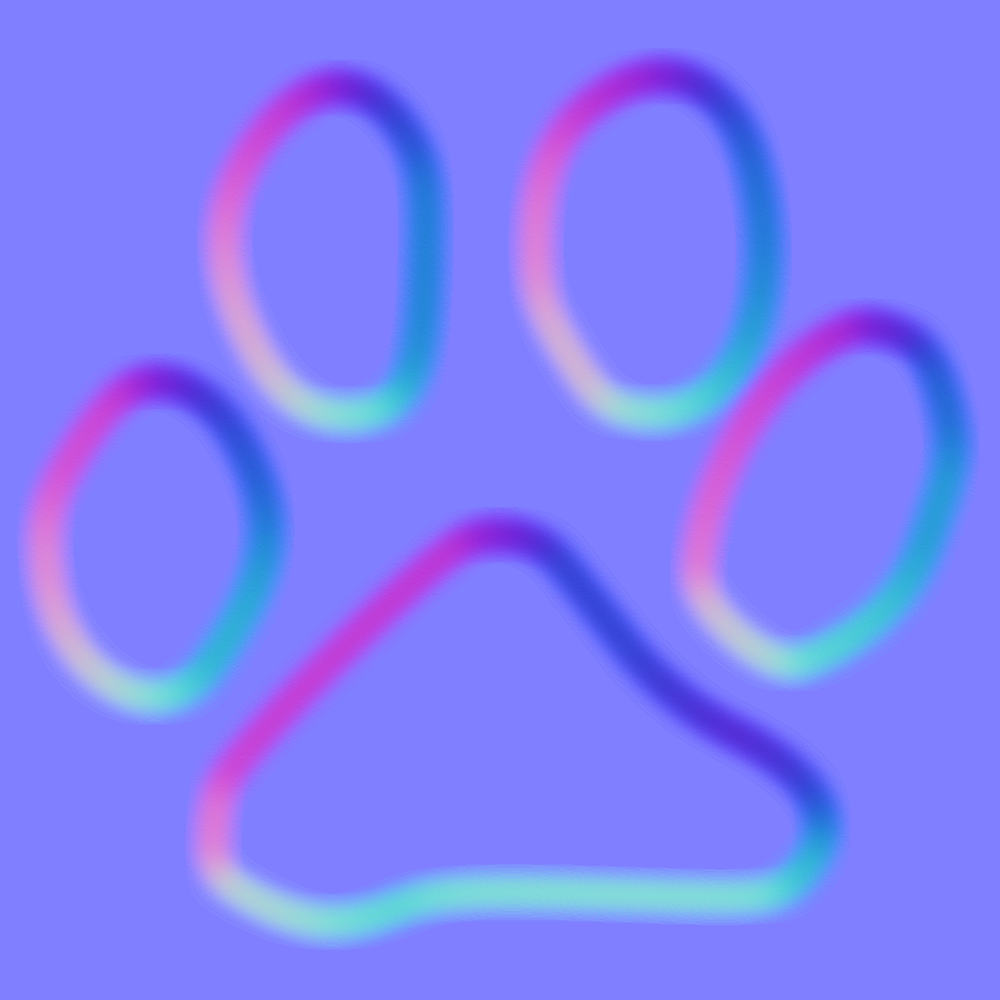
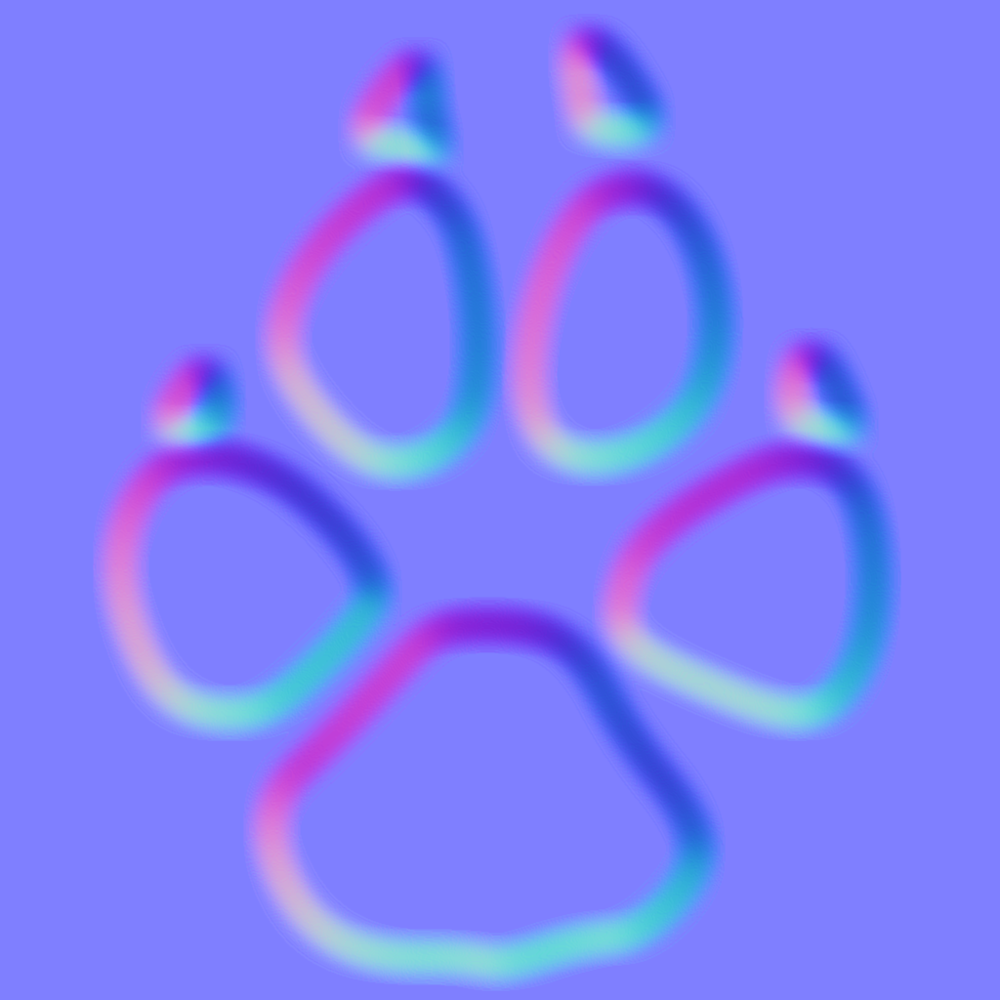
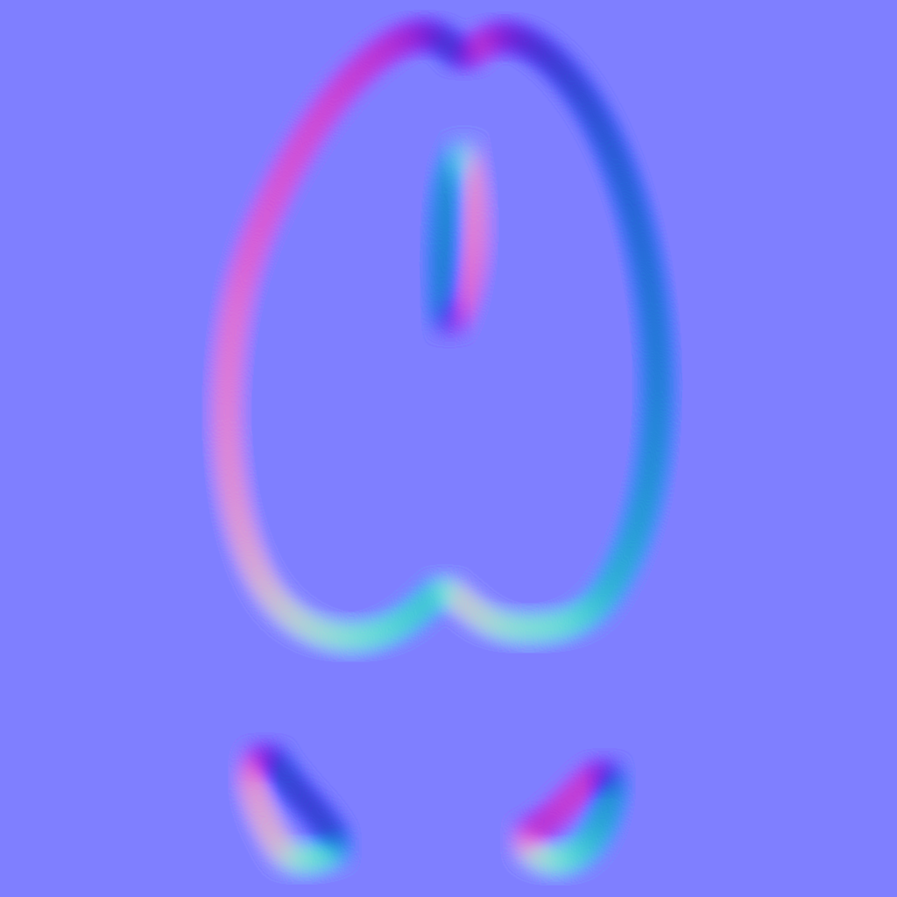
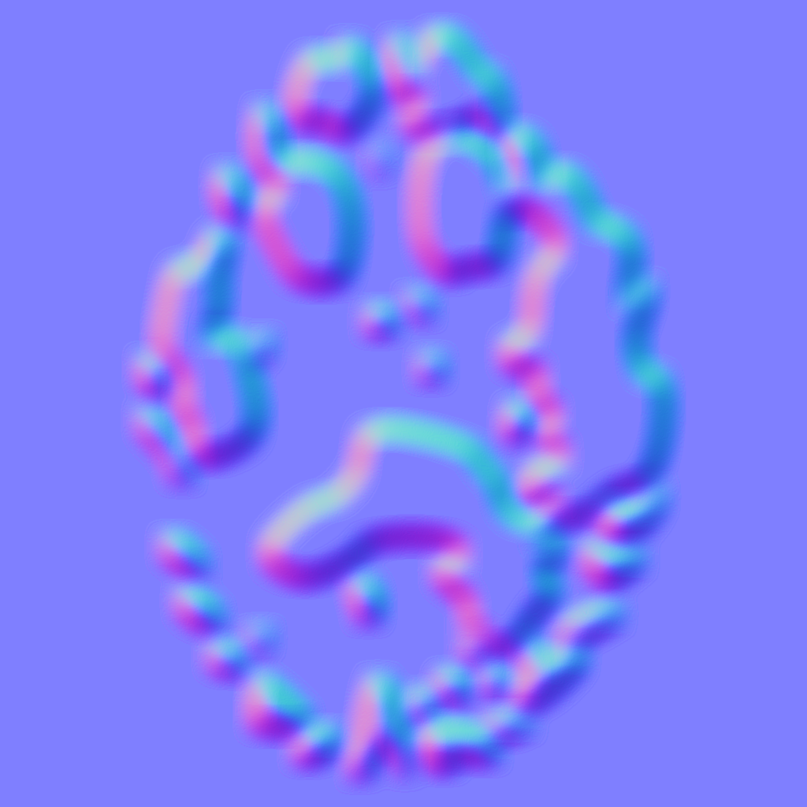
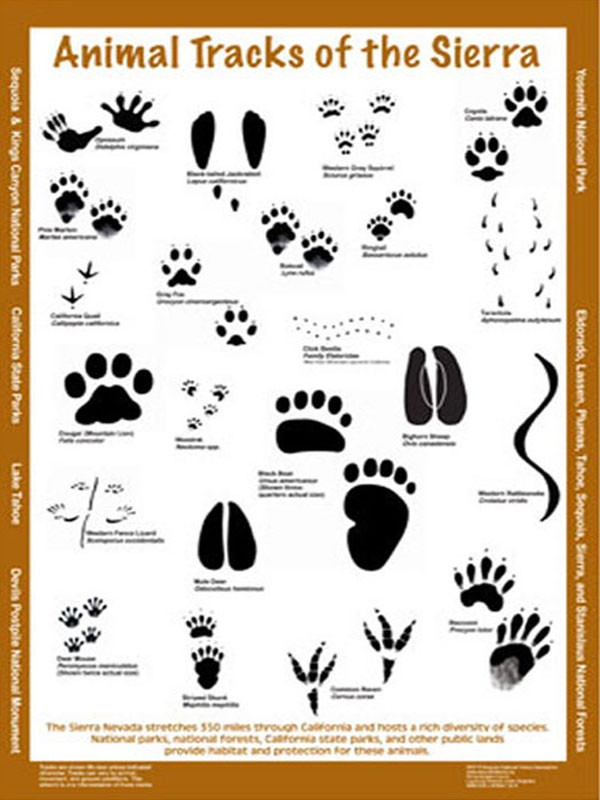

           

# Animal Tracks 
                                                                                                                                                                                                                                                                                                                                                                                                                                    

A collection of free vector graphics and images of animal tracks.  No attribution is required, do what you like.  I would love to see anything that you produce, though!  

*If you work for a conservation, fish, field, wildlife, parks, or similar service and need help using these, I'd be happy to donate my help.  These **can** be used freely, even in commercial works.*

## Included
- PNG files of initial track silhouette
- SVG files of the track outline
- PNG file of a high-quality rendering of the new silhouette
- PNG files of *my estimation* of the track's surface details, such as displacement and surface normals.  I'm considering adding other [physically based rendering](https://en.wikipedia.org/wiki/Physically_based_rendering) maps as well but these might be too dependent on the use case.

These are not scans - everything is derived from reference images which are included at the bottom of this document.  Feel free to make pull requests if you can improve or add something. Raise issues if you would like an animal added or modified.  If you can provide the track silhouette and dimensions, even better.  No guarantees but I'll do what I can.  If you want to have a crack on your own, follow the process below.

### Process
Once a silhouette for a track is obtained, the creation of the rest of the assets is relatively simple to invoke.
- A subdirectory named for the animal is created in the `tracks` directory.
- The silhouette is added to the subdirectory as `{id}_silhouette.png`.  `{id}` can be the animal name, or maybe `{animal-name}-front`, `{animal-name}-left`, etc.  This will be preserved in the output file names.
- `scripts/trace.py` can be executed, which will kick off the following:
  - [POTrace](http://potrace.sourceforge.net/) is used to convert the silhouette to SVG.
  - SVG is rendered to a new, high-quality PNG using [Wand](https://docs.wand-py.org/en/0.6.6/) (Python bindings for [ImageMagick](https://imagemagick.org/index.php)).
  - HQ silhouette is blurred to create a rough estimate of a [height map](https://en.wikipedia.org/wiki/Heightmap) using [Wand](https://docs.wand-py.org/en/0.6.6/).
  - A [normal map](https://en.wikipedia.org/wiki/Normal_mapping) is generated using code adapted from [Mehdi-Antoine's Normal Map Generator](https://github.com/Mehdi-Antoine/NormalMapGenerator), which in turn uses [SciPy](https://www.scipy.org/).  Normal maps describe the surface normal direction in a normalized XYZ vector.  X is right, Z is forward, and included are both Y-down (DirectX) and Y-up (OpenGL) formats.

## Status
The table below will be updated as I finish each track.

|Animal               |Silhouette|SVG|HQ Bitmap|Height|Normal (Y-)|Normal (Y+)|
|---------------------|----------|---|---------|------|----------------|---------------|
|Antelope             |              |              |              |               |              |             |
|Armadillo            |            |            |            |             |            |           |
|Badger               |                  |                  |                  |                   |                  |                 |
|Bear (Black) (Front) |    |    |    |     |    |   |
|Bear (Black) (Rear)  |     |     |     |      |     |    |
|Bear (Brown) (Front) |    |    |    |     |    |   |
|Bear (Brown) (Rear)  |     |     |     |      |     |    |
|Beaver               |                  |                  |                  |                   |                  |                 |
|Bison                |                    |                    |                    |                     |                    |                   |
|Bobcat               |                  |                  |                  |                   |                  |                 |
|Caribou              |                |                |                |                 |                |               |
|Cat                  |                        |                        |                        |                         |                        |                       |
|Cougar (Front)       |            |            |            |             |            |           |
|Cougar (Rear)        |             |             |             |              |             |            |
|Coyote               |                  |                  |                  |                   |                  |                 |
|Deer (Mule)          |            |            |            |             |            |           |
|Deer (Whitetail)     |  |  |  |   |  | |
|Dog                  |                        |                        |                        |                         |                        |                       |
|Elk                  |                        |                        |                        |                         |                        |                       |
|Ferret               |                  |                  |                  |                   |                  |                 |
|Fisher               |                  |                  |                  |                   |                  |                 |
|Fox (Kit)            |                |                |                |                 |                |               |
|Fox (Red)            |                |                |                |                 |                |               |
|Jack Rabbit          |          |          |          |           |          |         |
|Lynx                 |                      |                      |                      |                       |                      |                     |
|Marmot               |                  |                  |                  |                   |                  |                 |
|Marten               |                  |                  |                  |                   |                  |                 |
|Mink                 |                      |                      |                      |                       |                      |                     |
|Moose                |                    |                    |                    |                     |                    |                   |
|Mountain Goat        |    |    |    |     |    |   |
|Mountain Sheep       |  |  |  |   |  | |
|Muskox               |                  |                  |                  |                   |                  |                 |
|Muskrat              |                |                |                |                 |                |               |
|Ocelot               |                  |                  |                  |                   |                  |                 |
|Opossum              |                |                |                |                 |                |               |
|Otter                |                    |                    |                    |                     |                    |                   |
|Peccary              |                |                |                |                 |                |               |
|Pheasant             |              |              |              |               |              |             |
|Pig                  |                        |                        |                        |                         |                        |                       |
|Porcupine            |            |            |            |             |            |           |
|Prairie Dog          |        |        |        |         |        |       |
|Raccoon (Front)      |          |          |          |           |          |         |
|Raccoon (Rear)       |           |           |           |            |           |          |
|Skunk                |                    |                    |                    |                     |                    |                   |
|Squirrel (Gray)      |    |    |    |     |    |   |
|Turkey               |                  |                  |                  |                   |                  |                 |
|Wild Boar            |            |            |            |             |            |           |
|Wolf (Gray)          |            |            |            |             |            |           |
|Wolverine            |            |            |            |             |            |           |
|Woodchuck            |            |            |            |             |            |           |

### Sources & Thanks
The sources are all either free digital works found on the websites listed below, or now-digital photoscans of old references/pocket guides.  I've attributed what I can below.  Please let me know if you can identify the source of anything not listed.

|Source|Images|
|------|------|
|      ||
|[Hiking Michigan](https://hikingmichigan.wordpress.com/)||
|[Florida Fish And Wildlife Conservation Commission](https://hikingmichigan.wordpress.com/)||
|[Sequoia Parks Conservancy](https://store.sequoiaparksconservancy.org)||
|[MassWildlife](https://www.mass.gov/orgs/division-of-fisheries-and-wildlife)||
|[Virginia DWR](https://dwr.virginia.gov/)||

