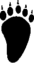

# Animal Tracks
A collection of graphics and images of animal tracks.  No attribution is required, do what you like.  I would love to see anything that you produce, though!  

*If you work for a conservation, fish, wildlife, parks, or similar service and need help using these, I'd be happy to donate my help.*

## Included
- PNG files of initial track silhouette
- SVG files of the track outline
- PNG file of a high-quality silhouette
- PNG files of *my estimation* of the track's surface details, such as displacement and surface normals.  

These are not scans - everything is derived from reference images, so they may not line up 100% with real world tracks.  Feel free to make pull requests if you can improve or add something. Raise issues if you would like an animal added or modified.  If you can provide the track silhouette and dimensions, even better.  No guarantees but I'll do what I can.  If you want to have a crack on your own, follow the process below.

### Process
Once a silhouette for a track is obtained:
- A subdirectory named for the animal is created in the `tracks` directory.  
- The silhouette is added to the subdirectory as `{animal-name}_silhouette.png`.  
- [POTrace](http://potrace.sourceforge.net/) is used to convert the silhouette to SVG.
- SVG is rendered to a new, high-quality bitmap.
- HQ bitmap is tweaked into an esimated height map.
- A normal map is generated using code adapted from [Mehdi-Antoine's Normal Map Generator](https://github.com/Mehdi-Antoine/NormalMapGenerator).

## Status
The table below will be updated as I finish each track.

|Animal               |Silhouette|SVG|HQ Bitmap|Displacement & Normals|
|---------------------|----------|---|---------|----------------------|
|Antelope             ||||
|Armadillo            ||||
|Badger               ||||
|Bear (Black) (Front) ||||
|Bear (Black) (Rear)  ||||
|Bear (Brown) (Front) ||||
|Bear (Brown) (Rear)  ||||
|Beaver               ||||
|Bison                ||||
|Bobcat               ||||
|Caribou              ||||
|Cat                  ||||
|Cougar (Front)       ||||
|Cougar (Rear)        ||||
|Coyote               ||||
|Deer (Mule)          ||||
|Deer (Whitetail)     ||||
|Dog                  ||||
|Elk                  ||||
|Ferret               ||||
|Fisher               ||||
|Fox (Kit)            ||||
|Fox (Red)            ||||
|Jack Rabbit          ||||
|Lynx                 ||||
|Marmot               ||||
|Marten               ||||
|Mink                 ||||
|Moose                ||||
|Mountain Goat        ||||
|Mountain Sheep       ||||
|Muskox               ||||
|Muskrat              ||||
|Ocelot               ||||
|Opossum              ||||
|Otter                ||||
|Peccary              ||||
|Pheasant             ||||
|Pig                  ||||
|Porcupine            ||||
|Prairie Dog          ||||
|Raccoon (Front)      ||||
|Raccoon (Rear)       ||||
|Skunk                ||||
|Squirrel (Gray)      ||||
|Turkey               ||||
|Wild Boar            ||||
|Wolf (Gray)          ||||
|Wolverine            ||||
|Woodchuck            ||||

### Sources
The original reference image is included with the repository, as well as a few cleaned up versions.  The original appears to be a scan from a book, and has been shared hundreds of times across the internet.  I can not find the original source, but if you know it I would appreciate being able to cite it here.

